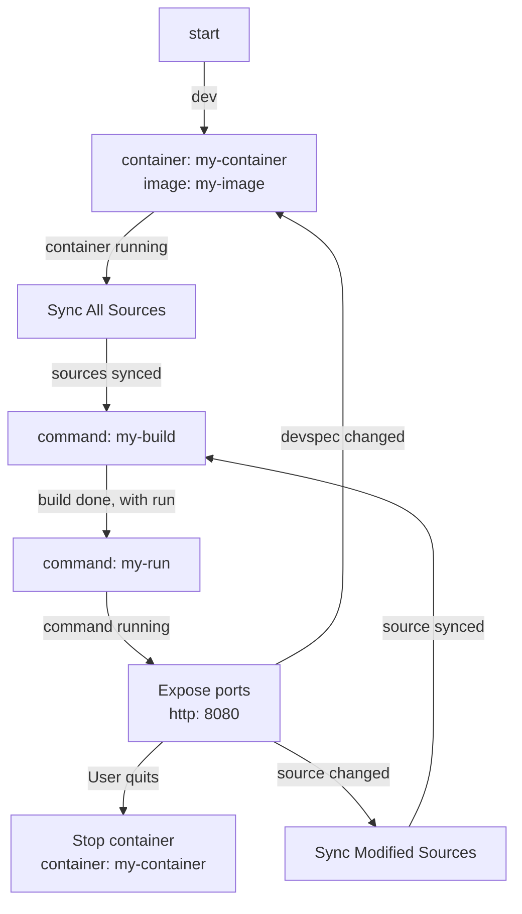

# Devspec Analyzer

The objective of this tool is to parse a [Devspec](https://devspec.io/) and extract its execution lifecycle.

The initial version focuses on generating a visual representation of the Devspec lifecycle graph.

This is an evolving implementation with partial Devspec feature coverage. Refer to examples below to verify supported capabilities.

For instance, given a Devspec [container-build-run.yaml](./tests/devspecs/container-build-run.yaml) declaring a single component and two commands, *build* and *run*, the lifecycle is visualized as:



The tool outputs Mermaid-standard text format. This output integrates with Mermaid-compatible tools (GitHub pages, IDEs, inline visualizers) for graphical rendering.

## Usage

```bash
# From a local file
$ go run main.go path/to/my/devspec.yaml > devspec.md

# From a Devspec Registry (include trailing /)
$ go run main.go https://registry.devspec.io/devspecs/nodejs-basic/ > nodejs-basic.md
```

## Examples

Examples are available in the [tests/graphs directory](./tests/graphs), with corresponding Devspec sources in [tests/devspecs directory](./tests/devspecs).


## Next steps

Future iterations will develop a library (initially in Go) providing a state-machine implementation based on the Devspec, usable by Devspec-compatible tools.
